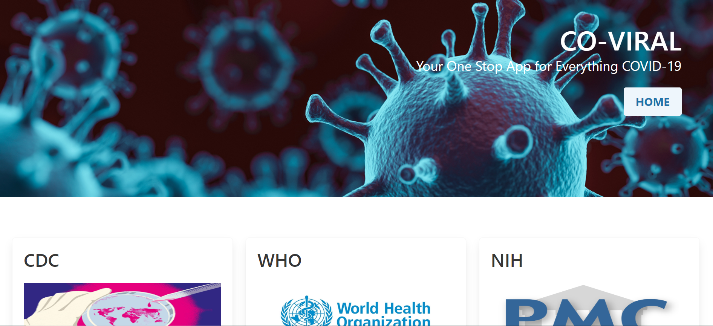

# CO-VIRAL-Group-5
Project 1, Group 5

## Project Description
Our app aims to create a user-friendly resource for community members to easily access the most noteworthy, accurate, and verifiable content regarding COVID-19, and other emerging health concerns, through a simple, direct, and responsive platform. 

By “bypassing” social media and using only the above described sources of information, our app aims to educate, inform, and calm users during the health crisis caused by COVID-19. In the future, our app can be used to remain informed regarding other noteworthy or emerging health concerns.

## User Story
AS A person without a science background or medical training

I WANT TO view only validated information from experts

SO THAT I can prevent panic and negativity when making health decisions for myself and my family regarding COVID-19.

## Features
A home page that includes tiles containing:
- feature articles from the CDC, WHO and NIH (title, intro and link)
- previews and links to our three main pages (What You Need to Know, Current Data, Top Articles)
- a Quick Fact section about the disease COVID-19 itself called Street Smarts
- two short videos with basic overview information about COVID-19 and the coronavirus that causes it
- a section describing the purpose of our app and an intro to our creative team
- to ease stress, a randomly generated meme relating to the struggles of social distancing and quarantine is displayed in the center of the page

Three linked informative pages with the titles What You Need To Know, Current Data, and Top Articles
- What You Need To Know features the most current information from the CDC, WHO, and NIH regarding basic information, guidance through social distancing and other recommendations, and latest developments.
- Current Data displays global pandemic statistics including totals for confirmed cases, deaths, critical cases, and recovered cases and provides a search by country of this data. It also displays a chart comparing current COVID-19 death rates with the totals of historical pandemics such as the 1918 Spanish flu, to help keep our situation in perspective.
- Top Articles displays a selection of informative articles sourced from the CDC, WHO and NIH that the user can browse and follow a link to read the whole article.

## Link to the COVIRAL app

https://robynp108.github.io/CO-VIRAL-Group-5/

## Screenshot

--

